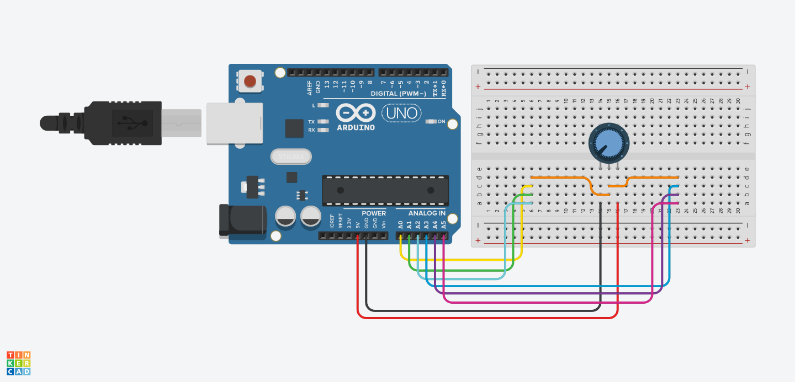

[![Contributors][contributors-shield]][contributors-url]
[![Forks][forks-shield]][forks-url]
[![Stargazers][stars-shield]][stars-url]
[![Issues][issues-shield]][issues-url]
[![LinkedIn][linkedin-shield]][linkedin-url]

<div id="top"></div>

<br />
<div align="center">
  <a href="https://github.com/lorenzopalaia/Arduino-Oscilloscope">
    
  </a>

<h3 align="center">Arduino Oscilloscope</h3>

  <p align="center">
    Arduino oscilloscope with timed sampling of up to 8 channels on the ADC and streaming on PC
    <br />
  </p>
</div>


<!-- ABOUT THE PROJECT -->
## About The Project

Project was developed for "Sistemi Operativi" class, Ingegneria Informatica e Automatica, Università La Sapienza

<p align="right">(<a href="#top">back to top</a>)</p>


### Built With

* [Arduino](https://www.arduino.cc/)

<p align="right">(<a href="#top">back to top</a>)</p>


<!-- GETTING STARTED -->
## Getting Started

### Arduino Scheme


### Installation

1. Clone the repo
   ```sh
   git clone https://github.com/lorenzopalaia/Arduino-Oscilloscope.git
   ```
   
<p align="right">(<a href="#top">back to top</a>)</p>


<!-- CONTACT -->
## Contact

Lorenzo Palaia - lorenzopalaia53@gmail.com

Project Link: [https://github.com/lorenzopalaia/Arduino-Oscilloscope](https://github.com/lorenzopalaia/Arduino-Oscilloscope)

<p align="right">(<a href="#top">back to top</a>)</p>


<!-- MARKDOWN LINKS & IMAGES -->
<!-- https://www.markdownguide.org/basic-syntax/#reference-style-links -->
[contributors-shield]: https://img.shields.io/github/contributors/lorenzopalaia/Arduino-Oscilloscope.svg?style=for-the-badge
[contributors-url]: https://github.com/lorenzopalaia/Arduino-Oscilloscope/graphs/contributors
[forks-shield]: https://img.shields.io/github/forks/lorenzopalaia/Arduino-Oscilloscope.svg?style=for-the-badge
[forks-url]: https://github.com/lorenzopalaia/Arduino-Oscilloscope/network/members
[stars-shield]: https://img.shields.io/github/stars/lorenzopalaia/Arduino-Oscilloscope.svg?style=for-the-badge
[stars-url]: https://github.com/lorenzopalaia/Arduino-Oscilloscope/stargazers
[issues-shield]: https://img.shields.io/github/issues/lorenzopalaia/Arduino-Oscilloscope.svg?style=for-the-badge
[issues-url]: https://github.com/lorenzopalaia/Arduino-Oscilloscope/issues
[license-shield]: https://img.shields.io/github/license/lorenzopalaia/Arduino-Oscilloscope.svg?style=for-the-badge
[license-url]: https://github.com/lorenzopalaia/Arduino-Oscilloscope/blob/master/LICENSE.txt
[linkedin-shield]: https://img.shields.io/badge/-LinkedIn-black.svg?style=for-the-badge&logo=linkedin&colorB=555
[linkedin-url]: https://linkedin.com/in/lorenzo-palaia-7177a5202
[product-screenshot]: images/screenshot.png
