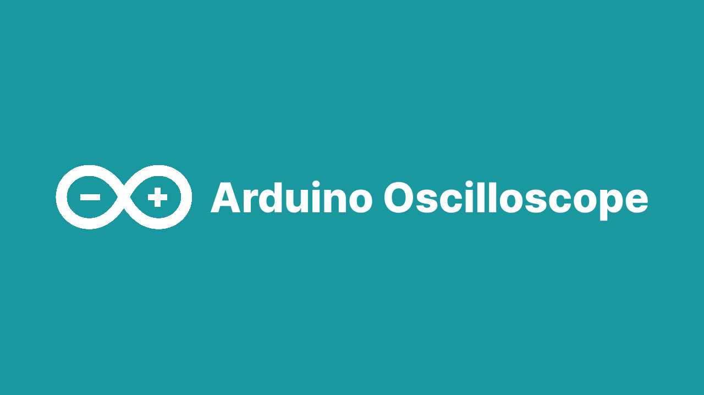
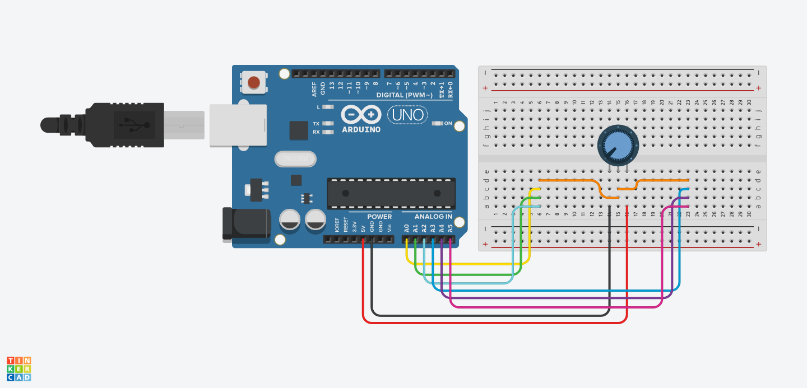

[![Contributors][contributors-shield]][contributors-url]
[![Forks][forks-shield]][forks-url]
[![Stargazers][stars-shield]][stars-url]
[![Issues][issues-shield]][issues-url]
[![LinkedIn][linkedin-shield]][linkedin-url]

<div id="top"></div>

<br />
<div align="center">
  <a href="https://github.com/lorenzopalaia/Arduino-Oscilloscope">
    
  </a>

<h3 align="center">Arduino Oscilloscope</h3>

  <p align="center">
    Arduino oscilloscope with timed sampling of up to 8 channels on the ADC and streaming on PC
    <br />
  </p>
</div>


<!-- ABOUT THE PROJECT -->
## About The Project



Project was developed for "Sistemi Operativi" class, Ingegneria Informatica e Automatica, Università La Sapienza. The project involves the development of an oscilloscope that samples an adjustable voltage through a potentiometer up to 8 channels. 

### Arduino

The oscilloscope samples in two modes, continuous and buffered, according to the other parameters received by the computer which are the sampling frequency, the number of samples and the channels to be sampled. The communication is realized through interrupt and the sent strings are well defined so that they can be tokenized by both devices. The voltage value is sampled in a range between 0 and 1023 by the ADC, associated with the correct channel number and sent to the client on the computer that converts it into a voltage in the range between 0V and 5V.

### Client

The client starts searching the Arduino among the serial ports, opens its file descriptor, sets the communication parameters via termios and finally opens the descriptors of the output files. This whole phase is accompanied by a precise error handling. In the main loop, the program asks the user to enter the parameters for sampling, asks for confirmation by showing them and sends them on the serial. The user input phase is also readily managed, this time by macros. The client then puts on hold to receive the samples on the serial and then writes them to the output files, one for each channel. An interrupt manager has been installed to exit the main loop. When this is called, it will execute the functions to terminate the program correctly, taking care to close all the open resources in order to not occur in memory leaks.

### Gnuplot

A last line is inserted in the shell script which invokes Gnuplot to plot the sampled data at client termination.

<p align="right">(<a href="#top">back to top</a>)</p>


### Built With

* [Arduino](https://www.arduino.cc/)
* C
* AVR C
* Makefile
* [Gnuplot](http://www.gnuplot.info/)

<p align="right">(<a href="#top">back to top</a>)</p>


<!-- GETTING STARTED -->
## Getting Started

### Arduino Schematic
The schematic shown uses Arduino Uno but it is possible to extend it to Arduino Mega 2560 reaching up to 16 different channels. For demonstration purposes we use only one potentiometer so the sampled outputs will be the same on all channels



### Installation

1. Clone the repo
   ```sh
   git clone https://github.com/lorenzopalaia/Arduino-Oscilloscope.git
   ```

### Usage

1. Plug in your Arduino, wire it up, get in the project folder and run
   ```sh
   cd Arduino-Oscilloscope
   sh run.sh
   ```
   
<p align="right">(<a href="#top">back to top</a>)</p>

## Contributing

Contributions are what make the open source community such an amazing place to learn, inspire, and create. Any contributions you make are **greatly appreciated**.

If you have a suggestion that would make this better, please fork the repo and create a pull request. You can also simply open an issue with the tag "enhancement".
Don't forget to give the project a star! Thanks again!

1. Fork the Project
2. Create your Feature Branch (`git checkout -b feature/AmazingFeature`)
3. Commit your Changes (`git commit -m 'Add some AmazingFeature'`)
4. Push to the Branch (`git push origin feature/AmazingFeature`)
5. Open a Pull Request

<p align="right">(<a href="#readme-top">back to top</a>)</p>

<!-- LICENSE -->

## License

Distributed under the MIT License. See `LICENSE.txt` for more information.

<p align="right">(<a href="#readme-top">back to top</a>)</p>

<!-- CONTACT -->
## Contact

Lorenzo Palaia - lorenzopalaia53@gmail.com

Project Link: [https://github.com/lorenzopalaia/Arduino-Oscilloscope](https://github.com/lorenzopalaia/Arduino-Oscilloscope)

<p align="right">(<a href="#top">back to top</a>)</p>


<!-- MARKDOWN LINKS & IMAGES -->
<!-- https://www.markdownguide.org/basic-syntax/#reference-style-links -->
[contributors-shield]: https://img.shields.io/github/contributors/lorenzopalaia/Arduino-Oscilloscope.svg?style=for-the-badge
[contributors-url]: https://github.com/lorenzopalaia/Arduino-Oscilloscope/graphs/contributors
[forks-shield]: https://img.shields.io/github/forks/lorenzopalaia/Arduino-Oscilloscope.svg?style=for-the-badge
[forks-url]: https://github.com/lorenzopalaia/Arduino-Oscilloscope/network/members
[stars-shield]: https://img.shields.io/github/stars/lorenzopalaia/Arduino-Oscilloscope.svg?style=for-the-badge
[stars-url]: https://github.com/lorenzopalaia/Arduino-Oscilloscope/stargazers
[issues-shield]: https://img.shields.io/github/issues/lorenzopalaia/Arduino-Oscilloscope.svg?style=for-the-badge
[issues-url]: https://github.com/lorenzopalaia/Arduino-Oscilloscope/issues
[license-shield]: https://img.shields.io/github/license/lorenzopalaia/Arduino-Oscilloscope.svg?style=for-the-badge
[license-url]: https://github.com/lorenzopalaia/Arduino-Oscilloscope/blob/master/LICENSE.txt
[linkedin-shield]: https://img.shields.io/badge/-LinkedIn-black.svg?style=for-the-badge&logo=linkedin&colorB=555
[linkedin-url]: https://linkedin.com/in/lorenzo-palaia-7177a5202
[product-screenshot]: images/screenshot.png
